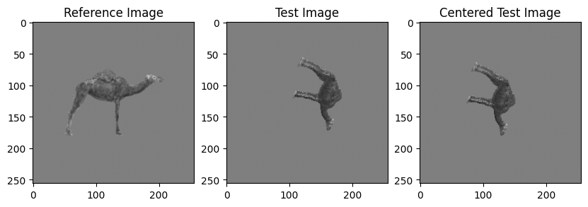
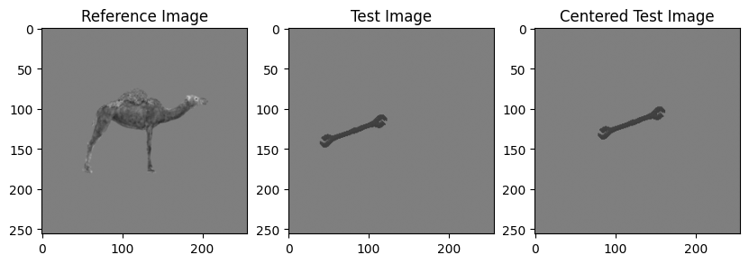
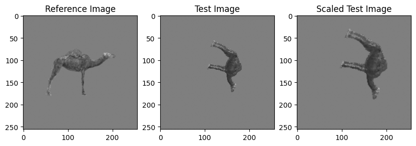
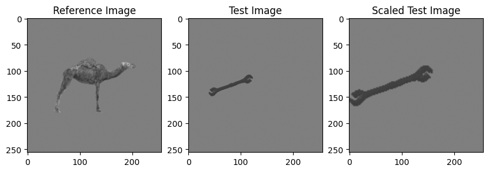
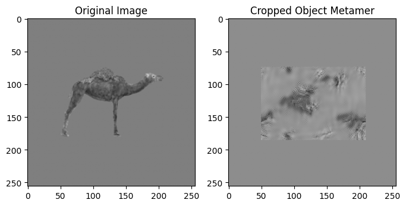
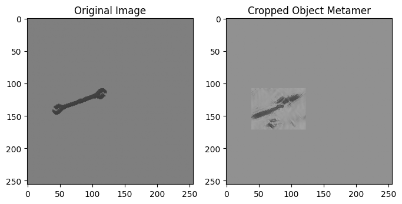
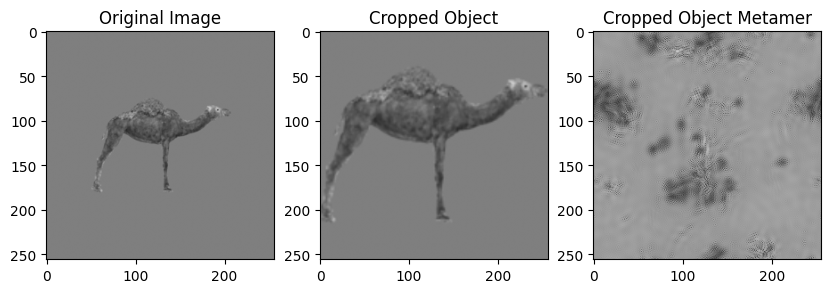
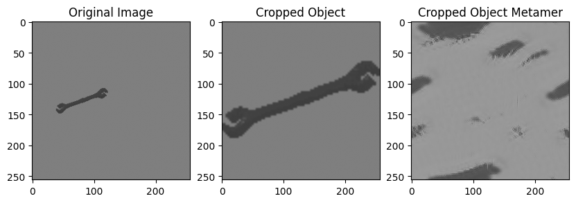
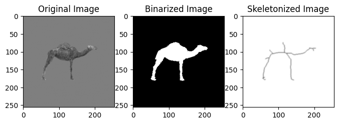
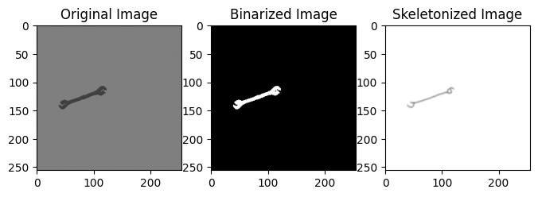

# Stimulus Transformations

A comprehensive Python library for stimulus image transformations including centering, scaling, texture synthesis, skeletonization, and neural network feature extraction. This library is designed for researchers in psychology, neuroscience, and computer vision who need to process and transform stimulus images for experiments or modeling.

## Installation

1. **Clone or download** the repository to your local machine
2. **Navigate** to the StimulusModeling directory:
   ```bash
   cd StimulusModeling
   ```
3. **Install** the package:
   ```bash
   pip install -e .
   ```

### Dependencies
The package requires:
- Python 3.8+
- NumPy, OpenCV, SciPy, Matplotlib, scikit-image
- PyTorch, torchvision, plenoptic

All dependencies will be automatically installed when you install the package.

## Quick Start

```python
import stim_transformations as stf
import cv2
import matplotlib.pyplot as plt
```

## Object Centering
This code currently works by inputting a reference object and test object which will be centered based on the center of mass of the reference. If there is no reference provided, will center object to the middle of the image .

```
centered_img = stim_transformations.setup(img_test, operation = 'center', img_ref = img_ref)
```



## Object Scaling
This code currently works by inputting a reference object and test object. The test object will be scaled to match its largest dimension (height or width) to the size of the largest dimension of the reference. If scaling the test image causes it to exceed the bounds of the image, it will move the object to keep it inside the image. Next step will be just scaling the object to fill one dimension of the image if there is no reference provided.

```
scaled_img = stim_transformations.setup(img_test, operation = 'scale', img_ref = img_ref)
```



## Object Texture Metamer In-Place
This function works by using the Freeman & Simoncelli texture synthesis model using [plenoptic](https://github.com/plenoptic-org/plenoptic/tree/main). This usage crops out the object from its background with a bounding box, synthesizes a metamer from the cropped image, then places it in a background of the same image size where the background is the average pixel value from the metamer. This keep the texture more contained rather than spreading it across the empty background and maintains position and shape information.

```
texture_img = stf.setup(img_test, operation = 'texture', n_scales=2, max_iter=1500, device='auto')
```



## Object Texture Metamer Cropped
This function works by using the Freeman & Simoncelli texture synthesis model using [plenoptic](https://github.com/plenoptic-org/plenoptic/tree/main). This usage crops the object from its background with a square bounding box, resizes the object to the target image size, then synthesizes the texture metamer. This reduces input from the blank background by cropping it out prior to synthesis, but eliminates location and object size information. Also outputs the cropped/resized object image for visualization.

```
cropped_img, texture_img = stf.setup(img_test, operation = 'texture_crop', n_scales=2, target_size=256, max_iter=1500, device='auto')
```



## Object Skeletonization

This function outputs a skeleton of the input object using the [scikit-image skeletonize](https://scikit-image.org/docs/0.25.x/auto_examples/edges/plot_skeleton.html) method. It also only requires a single image as input. This function also adds a Gaussian blur after skeletonization, although I may add functionality to turn this on or off in the future.

```
skeleton_img = stf.setup(img_test, operation='skeleton', area_threshold=3, blur_kernel=(5, 5), invert=True)
```



## Neural Network Activations

This function outputs the activations of each layer of a specific pre-trained neural network in response to test image. Currently supports AlexNet, VGG16, and resnet50 but can add more. 

```
activations = stf.setup(img_test, operation='NN', network='alexnet', layer_types=['Conv2d', 'Linear'], device='auto')
```